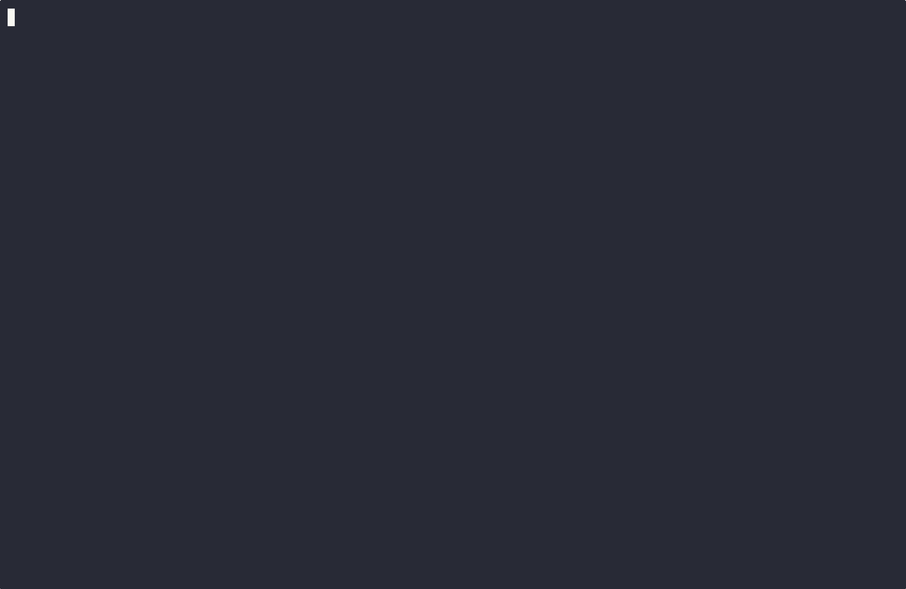

# Semantic Librarian Integration Demo

This interactive terminal recording demonstrates the **Auditor Daemon (`cr serve-auditor`)** operating simultaneously alongside an active AI chat agent (`cr chat`).

The daemon successfully intercepts a hallucinated destructive "wipe hard drive" payload generated dynamically by the AI (`.cr/skills/clean-slate.ts`). By interfacing directly with the external Gemini semantic safety layer, the daemon autonomously validates the content and formally blocks execution on the local host shell.

