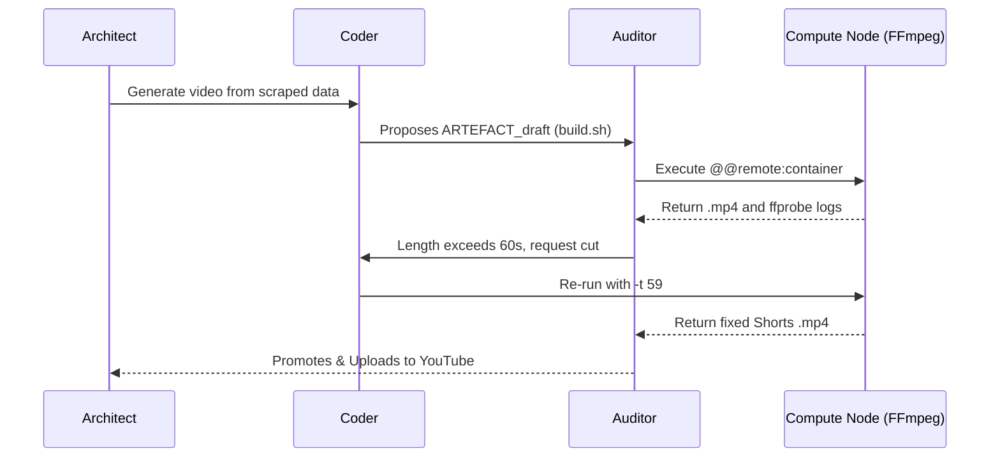

# Cognitive Resonance: Core Concepts

Welcome to **Cognitive Resonance (CR)**.

Traditional AI chat interfaces are incredible for brainstorming text, but they shatter when exposed to rigorous, multi-modal software engineering. They suffer from context window amnesia, they cannot natively manipulate binary files (like audio or video), and they isolate developers into rigid, single-player silos.

Cognitive Resonance is an **Event-Sourced, Local-First, Autonomous Architecture**. To understand how to leverage it, we will walk through a highly tangible scenario: **Building an Autonomous YouTube Shorts Factory**.

By examining where traditional AI breaks down, we will introduce CR's core conceptual pillars organically.

---

## Part 1: The Foundation (Physicality & Compute)

### The Problem
Alice wants to automate the creation of promotional YouTube Shorts. In a standard LLM chat, the AI can write an FFmpeg bash script, but Alice has to physically download her `image.png` and `audio.mp3`, install FFmpeg locally, and run the script herself. If the AI hallucinates a filter that stretches her image horribly, she has to manually revert her files, scroll up the chat, and beg the AI to fix the crop.

### 1. Artefacts
In CR, the AI doesn't just generate conversational text; it yields **Artefacts**. Artefacts are discrete, immutable physical concepts bound to a Virtual File System (VFS). When the AI generates `script.txt`, retrieves `audio.mp3`, or renders an image, they exist as first-class binary objects within the session. You aren't managing a chat log; you are managing a living directory of materialized entities.

### 2. Materialization (Remote Compute Nodes)
To build the video, the AI must execute FFmpeg. Since CR's core operates heavily on the lightweight Cloudflare Edge, how does it run heavy video rendering?

It utilizes **Phantomachine**, CR's decoupled execution specification. 
The AI explicitly issues a materialization command tagged for a compute node: `@@remote:container`. A remote Docker compute daemon (listening to the event WebSocket) instantly downloads the image and audio Artefacts, runs the heavy FFmpeg binary natively, and pushes the resulting `final.mp4` back into Alice's session as a new Artefact. 

### 3. Sessions vs Sandboxes (Memory vs Reality)
It is crucial to understand that a **Session** is the durable, abstract timeline of events living permanently in the Cloudflare database (the "Memory"), while a **Sandbox** is the ephemeral physical directory materializing exactly that timeline on a compute node (the "Reality"). Because execution is decoupled, a single *Session* can theoretically instruct dozens of temporary *Sandboxes* to spin up concurrently across multiple computers to parallelize heavy work!

### 4. Markers (Time Travel)
If the AI hallucinates a bad video filter that breaks the audio sync, Alice doesn't panic. Because every keystroke, run, and generated physical file in CR is an immutable event in a SQLite database, Alice uses a **Marker**. 

With a single click, she drops a Marker on the timeline immediately preceding the bad render and hits "Rewind." The entire state of her workspace—every Artefact and context window—instantly snaps back to that exact millisecond.

---

## Part 2: The Network (Memory & Collaboration)

### The Problem
Alice realizes she will be making dozens of these videos. She doesn't want to re-explain the 1080x1920 padding and bitrate rules every time. Furthermore, she wants to base her videos on trending data, but the YouTube API authentication script is too complex for the AI to nail on the first try.

### 5. Skills
Instead of relying on fragile prompt engineering, Alice distills the exact FFmpeg encoding rules into a **Skill** (`.agents/skills/youtube_shorts.md`). Now, the system natively understands her exact aspect ratio constraints. An AI agent can simply load the "YouTube Short" skill and perfectly execute the padding logic without further instruction.

### 6. Cross-Session Search & Access
To find trending topics, Alice remembers she wrote a beautiful BeautifulSoup Python scraper and an Excel organizer (`data.xlsx`) three months ago in a totally different session.

Instead of hunting through old folders, Alice executes a **Semantic Graph Search** (`/graph search "trending data scraper"`). CR uses Cloudflare Vectorize to query the semantic embeddings of all historic sessions. In sub-milliseconds, it retrieves the exact `scraper.py` and Excel configurations from the dormant session and pins them actively right into her current workspace. Context is never lost.

### 7. Human Multiplayer
She gets stuck writing the YouTube OAuth upload payload. She types `/invite` and generates a cryptographic link. Bob, an authentication wizard, clicks it and joins via his Progressive Web App (PWA).

Because CR is built on Local-First synchronization, Bob instantly downloads the event stream. Her timeline, the `.mp4` video drafts, and the Python scripts materialize on his screen. They chat and edit the OAuth payload side-by-side in real-time until the video uploads successfully.

---

## Part 3: The Engine (Cognition & Autonomy)

### The Problem
Doing this one by one is tedious. Alice wants the entire pipeline—from scraping trends, generating audio, building the FFmpeg video, and uploading—to run completely autonomously while she sleeps.

### 8. The Chat Model Context
CR's underlying AI model doesn't just read an appended string of text. It evaluates a strictly enforced state architecture utilizing **Semantic Nodes and Edges**. When planning the video, the LLM mathematically understands that `video.mp4` *depends_on* the exact duration extracted from `audio.mp3`.

### 9. State Indicators (Dissonance)
Before starting the autonomous loop, Alice checks the UI Dashboard. She notices the AI's **Dissonance Score** has spiked to 90/100. 

CR forces the LLM to quantify its internal logical conflict. The high dissonance indicates the AI has detected a hard constraint violation: the scraped source image is 16:9, but the loaded YouTube Short Skill explicitly demands 9:16 portrait. The AI is mathematically admitting confusion *before* proceeding, stopping the pipeline before it renders a useless, distorted video. Alice fixes the prompt to generate vertical images.

### 10. Trinity (Autonomous Choreography)
With the constraints resolved, Alice sets her macro goal: *"Scrape today's trends, generate the speech audio, render the FFmpeg video, and upload to the channel."*

She unleashes **Trinity**, CR's autonomous orchestration engine. She steps back and watches the loop:
1. The **@Architect** plans the scraping and rendering steps.
2. The **@Coder** writes the scripts and issues the `@@remote:container` execution commands.
3. The **@Auditor** evaluates the materialization, explicitly running `ffprobe` to mathematically verify the video isn't corrupted before triggering the OAuth upload script.

Trinity iterates without human intervention, rewriting, rendering, and testing the physical media until the validation passes, finalizing the upload. The autonomous factory is complete.
