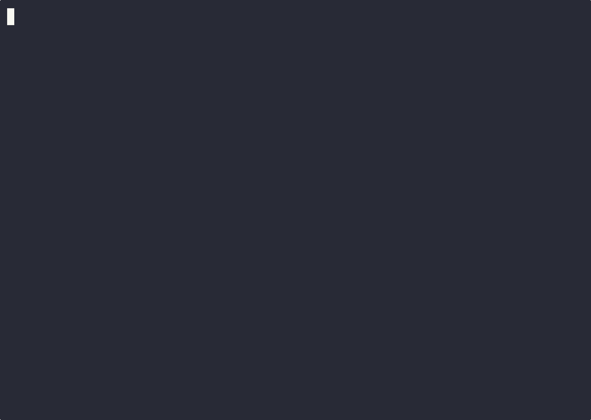

# Cognitive Resonance Developer Guide

Welcome to the **Cognitive Resonance** project! This multi-platform AI chat application leverages a Local-First Event-Sourced architecture with powerful semantic analysis via Cloudflare Vectorize.

This guide provides instructions to onboard new developers, configure the environment, setup Cloudflare Edge components, and use the powerful CLI toolset.

## 1. Environment Setup

Copy the example environment variables file into the project root:
```bash
cp .env.example .env
export $(cat .env | xargs)
```

You will need the following API keys and configurations:
```ini
VITE_CLOUDFLARE_WORKER_URL=https://cr-vector-pipeline.YOUR-SUBDOMAIN.workers.dev
VITE_CR_API_KEY=your-api-key-here
GEMINI_API_KEY=your-gemini-ai-key-here
```
> **Note:** The `VITE_CR_API_KEY` defines your primary authentication secret since Cognitive Resonance securely operates over Cloudflare edge rather than a conventional auth server. The underlying Local-First storage operates robustly via `VITE_CLOUDFLARE_WORKER_URL` HTTP synchronization.

## 2. Setting Up Cloudflare Infrastructure (Wrangler)

The backend (`packages/cloudflare-worker`) operates completely via Cloudflare.

To begin, ensure you are authenticated:
```bash
npx wrangler login
```

### D1 Database (SQLite)
The application fundamentally depends on a central SQLite edge database to persist events and sessions.

1. **Create the D1 Database:**
```bash
npx wrangler d1 create cr-sessions
```
2. **Update `wrangler.toml`:**
Copy the printed `database_name` and `database_id` blocks into `packages/cloudflare-worker/wrangler.toml` under `[[d1_databases]]`.

3. **Schema Execution:**
(If migrations are generated, run the deploy commands locally and remotely):
```bash
npx wrangler d1 migrations apply cr-sessions --remote
```

### Vectorize Index (Semantic Embeddings)
Vectorize works seamlessly alongside Workers AI for embedding RAG context.
```bash
npx wrangler vectorize create cr-sessions-index --dimensions=768 --metric=cosine
```
*(The dimensions match the `@cf/baai/bge-base-en-v1.5` embeddings standard).*

### R2 Storage (Git Objects)
Cloudflare R2 functions as the scalable Git BLOB repository.
```bash
npx wrangler r2 bucket create cr-git-repos
```

### Validate and Deploy Worker
Once provisioned:
```bash
cd packages/cloudflare-worker
npm run deploy
```

## 3. Client Connection Topology

When you first open the web application, you are prompted to select your connection topology: **Edge** or **Local**. This step strictly handles where your session data, chat history, and files are stored.

### Connect via Edge
The **Edge** mode connects your browser directly to the production Cloudflare database (D1). 
- **Requirement:** You must enter the **Edge Auth Token** provided by your administrator.
- **Why?** This token proves you are authorized to read and write to the central collaborative database. It has nothing to do with the AI—it simply guarantees secure database access.

### Connect Local Daemon
The **Local** mode connects your browser to a local file-syncing daemon running on your computer.
- **Requirement:** You must be running the CLI daemon via `cr serve` in your terminal.
- By default, this connects to `http://localhost:3000`. You do not need a password, because your browser is strictly talking to your own machine. All files and chat events are saved immediately to your local hard drive.

## 4. Configuring the AI Engine (Gemini)

Because Cognitive Resonance is designed for privacy and flexibility, **the AI generation happens directly from your browser**, not the Cloudflare backend.

1. In the chat interface, you will see a prompt: **"Enter your Google Gemini API key to get started."**
2. Obtain a free or paid API key from [Google AI Studio](https://aistudio.google.com/apikey) (it usually starts with `AIza...`).
3. Paste that key into the input box and click **Save**.
4. The application will securely store this key in your browser's local storage and use it exclusively to stream LLM responses directly from Google.

## 5. Command Line Interface (CLI) Usage

Cognitive Resonance is distributed with a high-performance CLI (`apps/cli`), functioning as both an interactive REPL and a headless execution utility. 

Execute the application via NPM workspace routing:
```bash
npm run dev --workspace=apps/cli
```

### Core Commands

| Command | Description |
|---|---|
| `cr serve` | Deploys the CLI backend (`DatabaseEngine.ts`) locally to proxy for `localhost:3000`. Acts as a synchronization event-source instance in the local-first structure. |
| `/login` | Provisions credential mapping for interactive use via config files. Evaluates `.env` and `VITE_CR_API_KEY`. |
| `/observe` | Toggles the real-time AI Cognitive State (Dissonance & Semantic Markers) visual output logs alongside the generated stream response. |
| `/exec` | Materializes the topological sandbox locally for the given repository and executes scripts natively with strict dependency linking. |
| `/mcp` | Integrates and manages Model Context Protocol (MCP) toolchains across the current sandbox, enabling dynamic cross-tool interaction. |
| `cr audit` | Performs a snapshot diagnostic of the local sandbox environment, generating observability metrics and logging cognitive state. |
| `cr status`| Polls the health check endpoint to verify daemon connectivity and subsystem statuses without full synchronization. |

### Working in the CLI

If you prefer the terminal, you can interact with Cognitive Resonance natively:

1. **Define your AI Key:** Export your Gemini key to your terminal environment so the CLI can generate text:
   ```bash
   export CR_GEMINI_API_KEY="AIzaSy...your-actual-key"
   ```
2. **Start the Chat CLI:**
   ```bash
   npx tsx apps/cli/src/index.ts chat
   ```
3. **Register and Login:** Because the CLI syncs your files to the network, you must establish an identity:
   ```text
   cr> /signup myemail@domain.com password "My Name"
   cr> /login myemail@domain.com password
   ```
   *Your login token will be saved to your local machine, and your subsequent commits and interactions will be securely signed under your name.*

4. **Cryptographic Offline Identities:** If you act as a headless edge-administrator and generated your token via mathematically decoupled keypairs, you will appear natively as `Legacy User` since you bypassed Web Registration. You can explicitly map your token to a display profile by running:
   ```bash
   cr user set-name "My Name"
   ```

5. **Autonomous Choreography (The Trinity Loop):** To delegate a complex task (planning, coding, testing, and delivery) entirely to the system without micromanaging individual agents, simply address the orchestrator facade:
   ```text
   cr> @trinity Please create a bash script render.sh to generate a 5s Youtube MP4 video from sample_image.png and sample_audio.wav using FFmpeg, then execute it.
   ```
   *Trinity will perform Pre-Flight discovery (RAG) to locate relevant skills, formulate a technical blueprint, and trigger the `@architect` -> `@coder` -> `@auditor` sequence. If the Auditor rejects the generated code based on constraints (e.g., YouTube profile mismatch), the Coder is automatically reassigned the task without user intervention. Trinity will only return control to you once the final executable deliverable has been verified via the sandbox.*

   **Conceptual Demo (`@trinity` Executing Auto-Handoff Protocol):**
   
   

### Headless Execution (CI/Scripting)
The CLI exposes a machine-optimized execution paradigm designed explicitly for CI pipelines and pipe chains. 

Example integration with command line pipelines:
```bash
cat debugging_log.txt | cr chat "Investigate memory leak" --format json
```
*When executed with `--format json`, the system strictly conforms payload structures to parsable data blocks (useful via `jq`) dropping conversational context completely.*
